# 1. Product introduction

**keyestudio Mini Tank Robot**

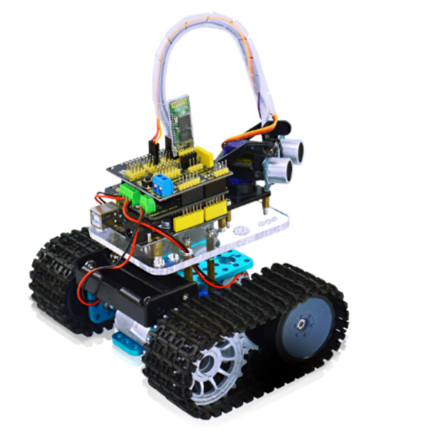

## 1.1 Introduction

Mini tank robot is a learning application development system of microcontroller based on Arduino. It has functions such as ultrasonic obstacle avoidance, bluetooth remotecontrol. This kit contains many interesting programs. It can also be expanded with external circuit modules to have further functions. This kit is designed to help you interestingly learn Arduino. You can learn Arduino MCU development ability while having fun.

## 1.2 Parameters

- Motor parameters: 6V, 150rpm/min 
- Use L298P driver module for motor control.
- Equipped with Ultrasonic module, can detect whether there are obstacles ahead, and the distance between the Tank robot and the obstacles to realize obstacle avoidance function.
- Equipped with Bluetooth wireless module, can remotely control the robot after pairing with mobile phone Bluetooth.
- Can be connected to external 7 ~ 12V power supply; with various sensor modules, it can realize various functions.

## 1.3 Component List

| No.  | Name                                           | QTY                    | Picture                                                      |
| ---- | ---------------------------------------------- | ---------------------- | ------------------------------------------------------------ |
| 1    | keyestudio REV4 Controller                     | 1                      | 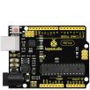                                          |
| 2    | keyestudio L298P Shield                        | 1                      | 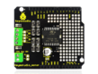                                          |
| 3    | keyestudio V5 Sensor Shield                    | 1                      | 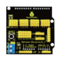                                          |
| 4    | HC-SR04 Ultrasonic Sensor                      | 1                      | 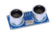                                          |
| 5    | keyestudio Bluetooth Module (HC-06)            | 1                      | 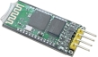                                          |
| 6    | Plastic Platform (PC)                          | 1                      | 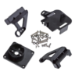                                          |
| 7    | Servo Motor                                    | 1                      | 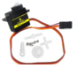                                          |
| 8    | Transparent Acrylic Board                      | 1                      |                                           |
| 9    | Metal Holder                                   | 4                      |                        |
| 10   | Tank Driver Wheel                              | 2                      | 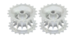                                          |
| 11   | Tank Load-bearing Wheel                        | 2                      | 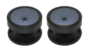                                         |
| 12   | Caterpillar Band                               | 2                      | 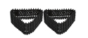                                         |
| 13   | Metal Motor                                    | 2                      | 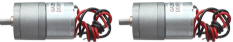                       |
| 14   | Copper Coupler                                 | 2                      | 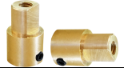                       |
| 15   | 18650 2-cell Battery Case                      | 1                      | 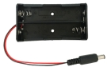                                         |
| 16   | USB Cable (1m)                                 | 1                      |                                          |
| 17   | Copper Bush                                    | 2                      |                        |
| 18   | Flange Bearing                                 | 4                      | 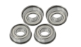                                         |
| 19   | Hexagon Copper Bush (M3*10MM)                  | 8                      | 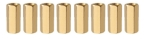                                         |
| 20   | Hexagon Copper Bush (M3*45MM)                  | 4                      | 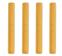                       |
| 21   | M3*10MM Flat Head Screw                        | 4 （2pcs standby）  | 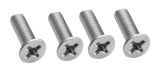                       |
| 22   | Inner Hexagon Screw (M4*35MM)                  | 4                      |                                          |
| 23   | Inner Hexagon Screw (M3*8MM)                   | 25 （2pcs standby)  | 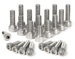                                         |
| 24   | Inner Hexagon Screw (M3*10MM)                  | 4                      | 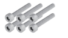                                         |
| 25   | Inner Hexagon Screw (M3*25MM)                  | 6 （2pcs standby)   | 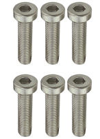                       |
| 26   | Inner Hexagon Screw (M4*12MM)                  | 5 （1pcs standby）  | 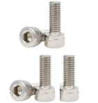                       |
| 27   | Inner Hexagon Screw (M4*50MM)                  | 3 （1pcs standby)   | 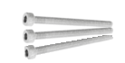                                         |
| 28   | Self-tapping Screw (M1.2*5MM)                  | 6 （2pcs standby）  | 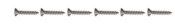 |
| 29   | M3 Nut                                         | 4 （2pcs standby）  | 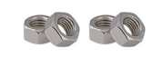                       |
| 30   | M4 Self-locking Nut                            | 3 （1pcs standby）  | 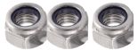                       |
| 31   | M4 Nut                                         | 15 （1pcs standby） | 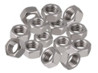                                         |
| 32   | Connector Wire (150mm, black)                  | 2                      |                                          |
| 33   | Connector Wire (150mm, red)                    | 2                      |                                          |
| 34   | Connector Wire (200mm, black)                  | 2                      |                                          |
| 35   | Connector Wire (200mm, red)                    | 2                      |                                          |
| 36   | F-F Dupont Wire (20CM, 4Pin)                   | 1                      | 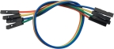                                         |
| 37   | Supporting Part (27*27*16MM, Blue or Orange)   | 2                      |                        |
| 38   | Winding Wire (12CM)                            | 1                      | 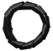                                         |
| 39   | 2.0*40MM Blue and Black Slotted Screwdriver    | 1                      |                                          |
| 40   | 2.0*40MM Purple and Black Phillips Screwdriver | 1                      | 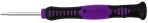                                         |
| 41   | L-type Nickeling M2 Allen Wrench               | 1                      |                                          |
| 42   | L-type Nickeling M3 Allen Wrench               | 1                      |                                          |
| 43   | L-type Nickeling M4 Allen Wrench               | 1                      |                                          |
| 44   | Nylon Cable ties                               | 4                      | 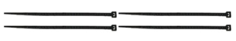                       |