# 2. Product installation

1. Attach the supporting part to the metal holder with a inner hexagon screw.

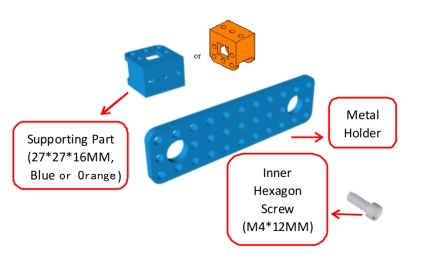

Then add a nut to fix the screw.

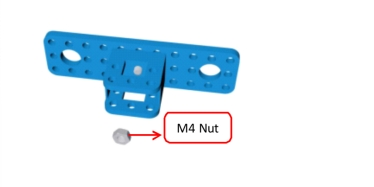

2. Plug a copper coupler into a metal motor.

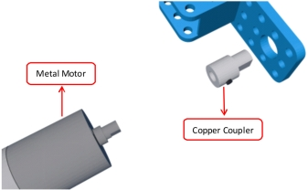

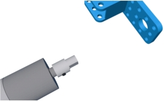

Then, reinforce them with a screwdriver.

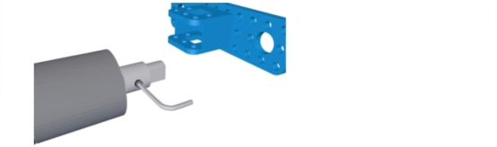

3. Fix the metal motor to the metal holder with two inner hexagon screws.

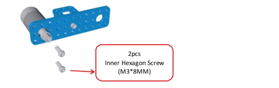

4. Plug a tank driver wheel into the metal motor and reinforce them with an inner hexagon screw.

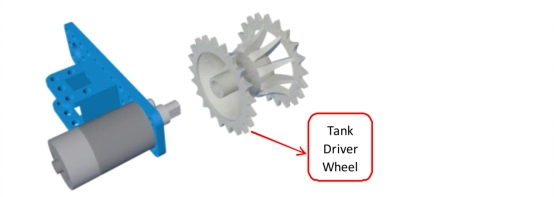

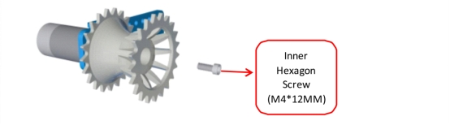

5. The tank load-bearing wheel is bolted to one screw and a copper bush. 

Then fix them with a flange bearing.

6. Put the tank driver wheel through a screw hole of the metal holder and the load-bearing wheel right into the caterpillar.

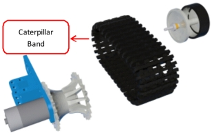

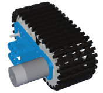

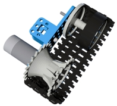

Next screw a flange bearing to fix the metal holder and the wheel.

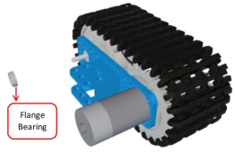

Then put a nut upon the flange bearing to reinforce.

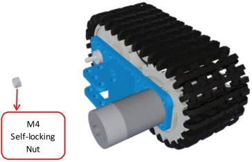

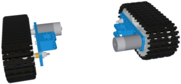

Finally combine the left part with the right part together.

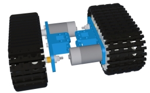

7. Attach the battery case to another metal holder with two flat head screws, using two nuts to fix them.

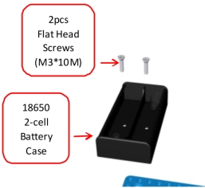

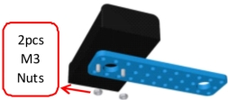

8. Fix four inner hexagon screws to the metal holder using 4 nuts.

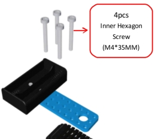

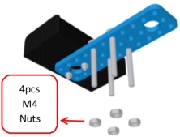

9.The battery is bolted to the supporting part with four nuts.

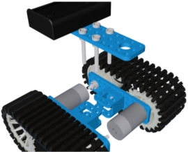

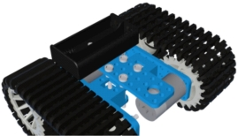

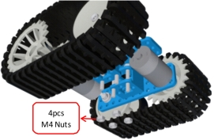

10. Attach another metal holder to the four screws and then reinforce them with four nuts.

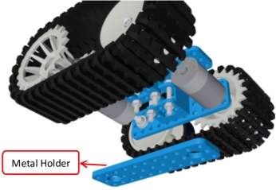

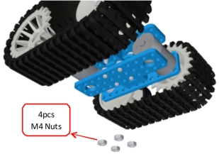

11. Plug four inner hexagon screws through the supporting part.

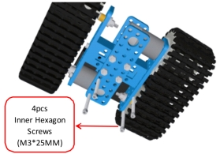

Then screw 4 copper bushes to the four hexagon screws.

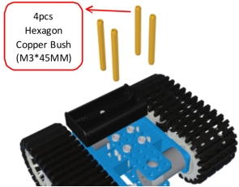

12. Screw 8 copper bushes upon a acrylic board using 8 inner hexagon screws. 

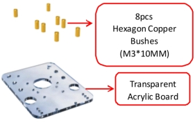

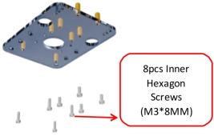

13. The acrylic board is bolted to the four copper bushes with 4 hexagon screws.

14. Cut the white cross to fit the size of the black cross and the attach the white one to the black one.

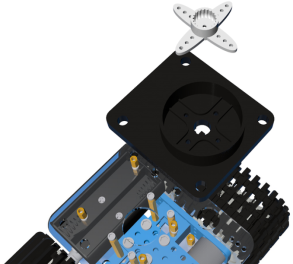

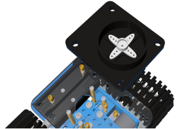

Then fix the white cross with four tapping screws.

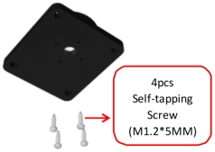

15. Put the blue platform upon the cross, 

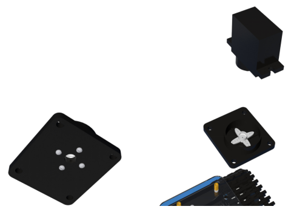

Then fix the platform using a tapping screw.

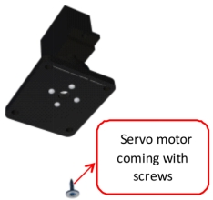

16. Attach the two holder together, and then fix them with two tapping screws.

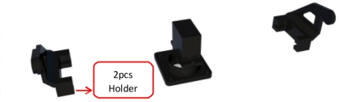

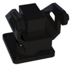

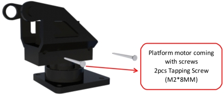

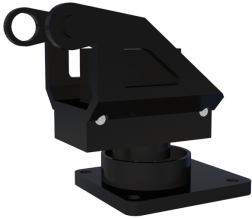

17. The whole platform is bolted to four short copper bushes using four inner hexagon screws.

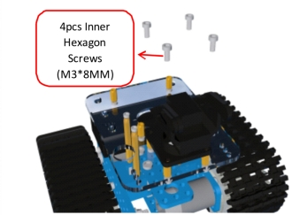

18. Tie the ultrasonic sensor up with the black holder using two pieces of ribbon. 

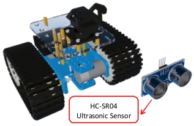

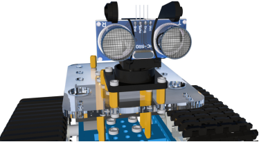

19. Attach the REV4 controller to the other four short copper bushes using four inner hexagon screws.

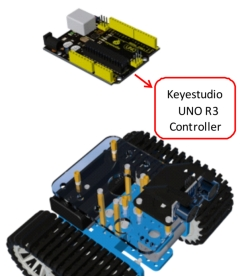

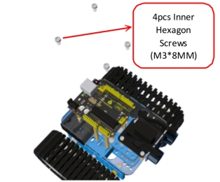

20. Plug the L298P shield into the controller;

Next plug the V5 sensor shield into the L298P shield;

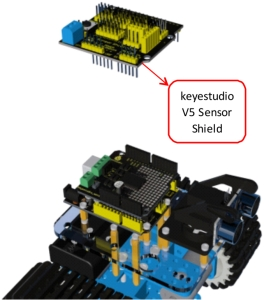

Finally plug the bluetooth into the serial ports on the V5 shield.

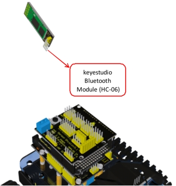

