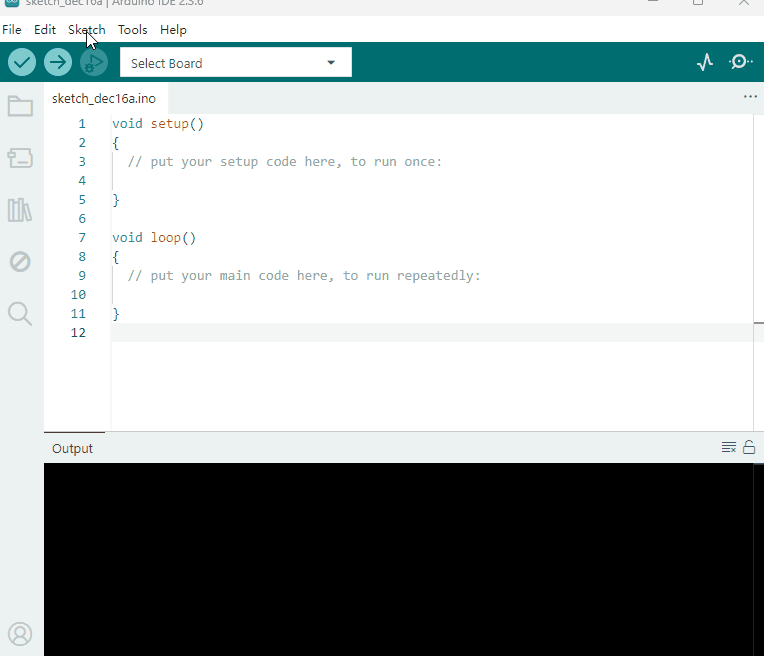

3. Arduino Tutorial
===================

3.1 Data download
-----------------

Arduino information contains library files 、project code and APP
,please click to download for follow-up study.

Data download: :download:`Arduino <./Arduino.7z>`

3.2 Software Download
---------------------

Open the browser and search: https://www.arduino.cc/en/software, we will
take WINDOWS system as an example to show you how to download and
install.

|image1|

You just need to click JUSTDOWNLOAD,then click the downloaded file to
install it. And when the ZIP file is downloaded,you can directly unzip
and start it.

|image2|

3.3 Set Arduino IDE
-------------------

Connecting the board to the computer，and select the development board
and port.

|image3|

3.4 Add Library
---------------

Open the Arduino IDE, follow [Sketch] → [Include Library] → [Add .zip
Library].

|image4|

3.5 Project
-----------

.. toctree::
    :maxdepth: 1

    Project/Project1
    Project/Project2
    Project/Project3
    Project/Project4
    Project/Project5

.. |image1| image:: media/1.gif
.. |image2| image:: media/2.gif
.. |image3| image:: media/Anima.gif

