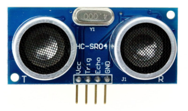
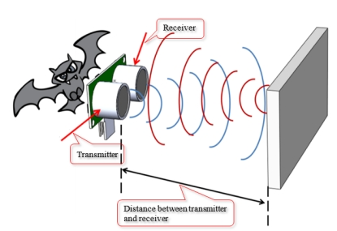
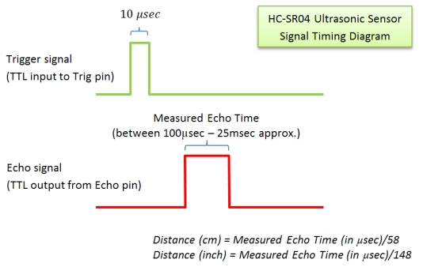
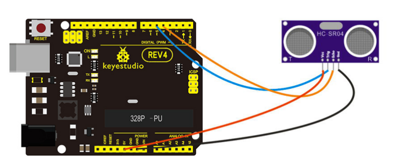
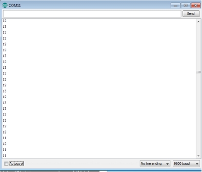

### Project 1 Ultrasonic Sensor



**1.Introduction**

The HC-SR04 Ultrasonic Sensor is a very affordable proximity distance sensor that has been used mainly for object avoidance in various robotics projects. It essentially gives your Arduino eyes spacial awareness and can prevent your robot from crashing or falling off a table. It has also been used in turret applications, water level sensing, and even as a parking sensor. This simple project will use the HC-SR04 sensor with an Arduino and a Processing sketch to provide a neat little interactive display on your computer screen.



**2.Specification**

- Working Voltage: DC 5V
- Working Current: 15mA
- Working Frequency: 40Hz
- Max Range: 4m
- Min Range: 2cm
- Measuring Angle: 15 degree
- Trigger Input Signal: 10µS TTL pulse
- Echo Output Signal Input TTL lever signal and the range in proportion

**3.Connection Diagram**






**4.Sample Code**

Wiring Method:

- VCC to Arduino 5v
- GND to Arduino GND
- Echo to Arduino pin 4
- Trig to Arduino pin 5

```c
#define echoPin 4 // Echo Pin
#define trigPin 5 // Trigger Pin
#define LEDPin 13 // Onboard LED
int maximumRange = 200; // Maximum range needed
int minimumRange = 0; // Minimum range needed
long duration, distance; // Duration used to calculate distance

void setup() 
{
  Serial.begin (9600);
  pinMode(trigPin, OUTPUT);
  pinMode(echoPin, INPUT);
  pinMode(LEDPin, OUTPUT); // Use LED indicator (if required)
}

void loop() 
{
  /* The following trigPin/echoPin cycle is used to determine the
  distance of the nearest object by bouncing soundwaves off of it. */ 
  digitalWrite(trigPin, LOW); 
  delayMicroseconds(2); 

  digitalWrite(trigPin, HIGH);
  delayMicroseconds(10); 
 
  digitalWrite(trigPin, LOW);
  duration = pulseIn(echoPin, HIGH);
 
  //Calculate the distance (in cm) based on the speed of sound.
 distance = duration/58.2;
 
  if (distance >= maximumRange || distance <= minimumRange)
  {
      /* Send a negative number to computer and Turn LED ON  to indicate "out of range" */
     Serial.println("-1");
     digitalWrite(LEDPin, HIGH); 
  }
  else 
  {
     /* Send the distance to the computer using Serial protocol, and turn LED OFF to indicate successful reading. */
    Serial.println(distance);
    digitalWrite(LEDPin, LOW); 
  }
  //Delay 50ms before next reading.
  delay(50);
}
```

**5.Result**

After connection and uploading, when ultrasonic sensor senses obstacle within sensing area, it is measuring the distance between itself and obstacle and the value of distance is displayed on serial monitor as shown in below figure.

