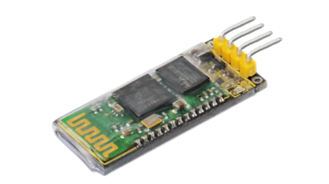
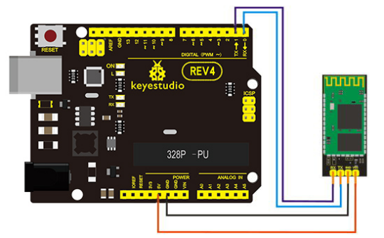
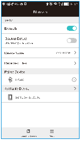
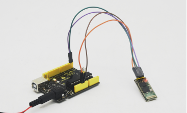
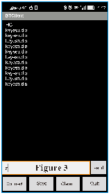

### Project 2 Bluetooth Module

**1.Introduction**



This Bluetooth module can easily achieve serial wireless data transmission. Its operating frequency is among the most popular 2.4GHz ISM frequency band (i.e. Industrial, scientific and medical). It adopts Bluetooth 2.1+EDR standard. In Bluetooth 2.1, signal transmit time of different devices stands at a 0.5 seconds interval so that the workload of bluetooth chip can be reduced substantially and more sleeping time can be saved for bluetooth. This module is set with serial interface, which is easy-to-use and simplifying overall design/development cycle.

**2.Specification**

- Bluetooth Protocol: Bluetooth 2.1+ EDR standard
- USB Protocol: USB v1.1/2.0
- Operating Frequency: 2.4GHz ISM frequency band
- Modulation Mode: Gauss frequency Shift Keying
- Transmit Power: ≤ 4dBm, second stage
- Sensitivity: ≤-84dBm at 0.1% Bit Error Rate
- Transmission Speed: 2.1Mbps(Max)/160 kbps(Asynchronous)； 1Mbps/1Mbps(Synchronous)
- Safety Feature: Authentication and encryption
- Supported Configuration: Bluetooth serial port (major and minor)
- Supply Voltage: 5 V DC 50mA
- Operating Temperature: -20 to 55℃

**3.Connection Diagram**



**4.Sample Code**

```c
int val; 
int ledpin=13; 

void setup() 
{ 
	Serial.begin(9600);
 	pinMode(ledpin,OUTPUT); 
} 

void loop()
{ 
	val=Serial.read(); 
	if(val=='a')
 	{ 
        digitalWrite(ledpin,HIGH); 
        delay(250); 
        digitalWrite(ledpin,LOW); 
        delay(250);
        Serial.println("keyestudio");
    }
}
```

**5.Result**

After powered up, power indicator D1 is on, and LED on Bluetooth module is blinking; open Bluetooth on mobile phone, pair them, input 1234, and finish pairing as shown in Figure 1 ; open APP—Bluetooth serial communication assistant, connect it to Bluetooth, select normal mode, complete connection, and LED on Bluetooth module is on as shown in Figure 2; input an “a” in the assistant, and display “keyesdudio” in it as shown in Figure 3.

Figure 1 - - - - - - - - - - - - Figure 2 - - - - - - - - - - - - - Figure 3





