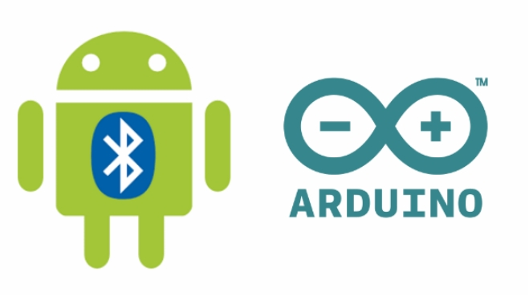
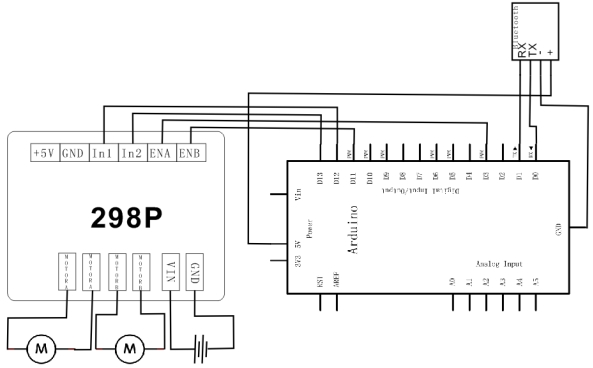
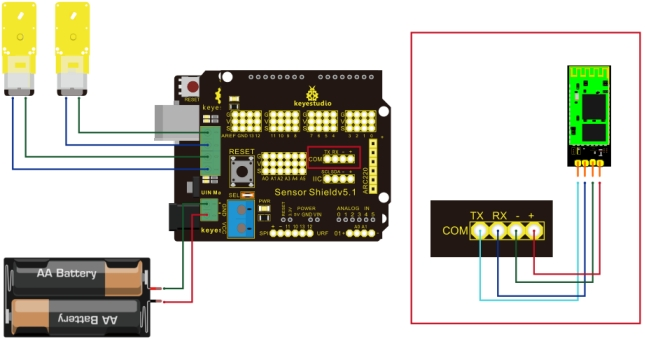

### Project 4 Bluetooth Control Tank Robot



**1.Introduction**

This project is a tank robot system based on Bluetooth communication, including software and hardware design. The controller part is a UNO board. A Bluetooth module is used to receive the Bluetooth signal from the cellphone and feedback the signal to the UNO. UNO will analyze the signal to determine and control the motors movement to adjust car moving direction. Therefore the tank robot can be controlled by cellphone.

**2.Working Principle**

- The Bluetooth module is connected to UNO; the module communicates with cell phone through a Bluetooth APP.
- The Bluetooth APP on the cell phone will pass information of “U”“D”“L”“R”“S” to the Bluetooth module.
- The Bluetooth module will pass the information to the UNO, so the UNO can determine car movement according to the information received.
- When the UNO receives a “U”, the car goes straight forward; when it receives a “D”, the car goes backward; “L” for turning left; “R” for turning right; and “S” for stop.

**3.Bluetooth Usage**

- Connect main board +5V to Bluetooth VCC, GND to Bluetooth GND, TX to Bluetooth RX and RX to Bluetooth TX.
- Remember to open the Bluetooth on your phone; when you open the Bluetooth APP, it will remind you. Pair up Bluetooth device on your phone, search and pair.
- Pair up device, PIN No. is 1234.
- Open Bluetooth APP and pair up Bluetooth device. After it’s paired, the Bluetooth module can communicate with cell phone.

Note: Before uploading test code, we can’t insert Bluetooth module, otherwise the program will fail to be uploaded. After uploading test code successfully, connect Bluetooth and Bluetooth module , pair and connect APP.

**4.Schematic and Connection Diagram**





**5.Sample Code**

```c
/*   
    L = Left 
    R = Right 
    F = forward 
    B = backward
*/
int pinLB = 12;     // define pin 12 
int pinLF = 3;     // define pin 3 
int pinRB = 13;    // define pin 13 
int pinRF = 11;    // define pin 11 
int val;

void setup()
{
  Serial.begin(9600);     // define pin for motor output 
  pinMode(pinLB,OUTPUT); // pin 12
  pinMode(pinLF,OUTPUT); // pin 3 (PWM)
  pinMode(pinRB,OUTPUT); // pin 13
  pinMode(pinRF,OUTPUT); // pin 11 (PWM) 
}

void advance()     // move forward
{ 
    digitalWrite(pinLB,LOW);    // right wheel moves forward
    digitalWrite(pinRB, LOW);  // left wheel moves forward
    analogWrite(pinLF,255);   
    analogWrite(pinRF,255);
}

void stopp()         // stop
{
     digitalWrite(pinLB,HIGH);
     digitalWrite(pinRB,HIGH);
     analogWrite(pinLF,0);
     analogWrite(pinRF,0); 
}

void right()        // turn right (single wheel)
{
   digitalWrite(pinLB,HIGH);  // left wheel moves forward
   digitalWrite(pinRB,LOW); // right wheel moves backward
   analogWrite(pinLF, 255);
   analogWrite(pinRF,255);   
}

void left()         // turn left (single wheel)
{
   digitalWrite(pinLB,LOW);  // left wheel moves forward
   digitalWrite(pinRB,HIGH); // right wheel moves backward
   analogWrite(pinLF, 255);
   analogWrite(pinRF,255);  
}

void back()          // move backward
{
	digitalWrite(pinLB,HIGH);  // motor moves to left rear
    digitalWrite(pinRB,HIGH);  // motor moves to right rear
    analogWrite(pinLF,255);  
    analogWrite(pinRF,255);     
}

void loop()
{ 
	val=Serial.read(); 
    if(val=='U')
    	advance();
    if(val=='D')
    	back();
    if(val=='L')
    	left() ;
    if(val=='R')
    	right();
	if(val=='S')
		stopp();
}
```

**6.Result**

Connected to Bluetooth APP, the movement of the car is controlled by the APP.